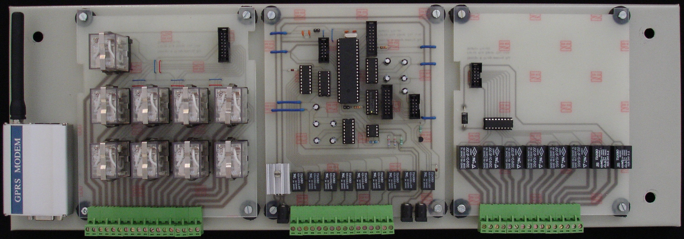
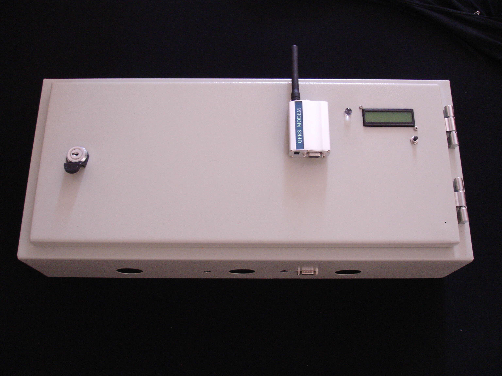

# GSM-Based Remote Monitoring and Control System (AVR)

## Overview

This project implements a modular embedded system for remote monitoring and control of electrical equipment using GSM communication. The system acquires sensor data, monitors the operational state of external devices, and allows remote interaction via SMS.

The system was designed and built as a complete hardware–software solution, including electronics, system integration, and low-level firmware written entirely in AVR assembly.

This project was developed as an early embedded systems implementation and is shared here as a representative example of system-level design, including hardware, firmware, and communication integration.

## What This Project Demonstrates

- Low-level embedded firmware development (AVR assembly)
- Hardware–software integration
- GSM/SMS-based remote control systems
- Multi-channel sensing and control

---

## System Architecture

The system is composed of three main hardware modules:

### 1. Status Sensing Module (Right Board)
- Interfaces with external 220V devices
- Detects the ON/OFF state of connected equipment
- Converts high-voltage state into isolated logic-level signals
- Provides real-time feedback to the microcontroller

---

### 2. Analog Measurement Module (Middle Board)
- Acquires analog signals from connected sensors
- Designed for general-purpose measurement (temperature, etc.)
- Temperature sensing (Pt100) implemented in firmware
- Provides processed signals to the microcontroller

---

### 3. Power Switching Module (Left Board)
- Controls external electrical devices
- Relay-based switching of 220V loads
- Supports higher-current operation
- Enables remote ON/OFF control of equipment

---

### Functional Overview

```
External Devices (220V)
   ↓            ↑
[ Status ]   [ Control ]
   ↓            ↑
   └──→ AVR Microcontroller ←──┘
                ↓
          GSM Modem (SMS)
                ↓
           Remote User
```

---

## Firmware Overview

The firmware is written entirely in AVR assembly for the ATmega16 microcontroller, implementing a complete embedded control system at the register level.

Main responsibilities include:
- UART communication with GSM modem (AT commands)
- SMS-based command parsing and response handling
- Timer-based scheduling using interrupts
- Sensor data acquisition and processing
- Device state monitoring
- Control logic for relay outputs
- LCD interface for local display

---

## Firmware Operation

At a high level, the firmware runs a tight main loop that:
- Receives UART data from the GSM modem and buffers it in RAM.
- Detects modem response strings and SMS arrival indications.
- Reads new SMS messages, parses commands, and applies requested actions.
- Periodically samples 8 analog channels and converts them to displayable values.
- Compares measurements and device states against configured ranges and targets.
- Sends SMS responses or warning notifications when needed.
- Maintains modem health (AT checks, timeouts, restart control).

This loop is paced by a Timer1 overflow interrupt that maintains seconds and minutes counters used for all timeouts and periodic actions.

---

## Firmware Highlights

- Implemented in pure AVR assembly (~3900 lines of code)
- Direct register-level control of microcontroller peripherals
- Custom implementation of communication, timing, and control logic
- No high-level libraries or frameworks used

---

## Communication

- GSM communication using Wavecom modem
- AT command interface over UART
- SMS-based interaction:
  - Receive commands
  - Send status updates
  - Send warning messages

---

## SMS Command Summary

Commands are parsed from the SMS body and are case sensitive.

- `T_ONx` turns relay output `x` ON (x = 0..7).
- `T_OFFx` turns relay output `x` OFF (x = 0..7).
- `SENDTPS` sends current temperatures and device states.
- `SENDR` sends configured ranges and desired states.
- `TR_x:ab-cd` sets temperature range for channel `x` (x = 0..7).
- `PR_x:y` sets desired ON/OFF for channel `x` (y = `0` or `1`).
- `TC_x:abc_def-ghi` sets calibration data for channel `x` (x = 0..7).
- `TWx` acknowledges temperature warning channel `x` (x = 0..7).
- `PWx` acknowledges power warning channel `x` (x = 0..7).

---

## Message Examples

Example commands:
- `T_ON3`
- `T_OFF0`
- `TR_2:35-10`
- `PR_4:1`
- `SENDTPS`

Example status response (format):
```
T1:dd,T2:dd,T3:dd,T4:dd,T5:dd,T6:dd,T7:dd,T8:dd
P1:F|N,P2:F|N,P3:F|N,P4:F|N,P5:F|N,P6:F|N,P7:F|N,P8:F|N
S1:F|N,S2:F|N,S3:F|N,S4:F|N,S5:F|N,S6:F|N,S7:F|N,S8:F|N
```
Legend:
- `Tn` are two ASCII digits for channel `n`.
- `P` are actual sensed power states (`F` or `N`).
- `S` are relay output states (`F` or `N`).

---

## Key Features

- Remote control of devices via SMS (ON/OFF)
- Monitoring of real device states (feedback from 220V side)
- Multi-channel sensor acquisition
- Real-time system status reporting
- Automatic alert generation under abnormal conditions
- Autonomous operation based on predefined conditions
- Bidirectional communication with remote user
- Basic system-level fault handling

---

## Technical Specifications

- **Microcontroller:** ATmega16 (AVR architecture)
- **Firmware:** AVR assembly
- **Communication:** GSM (SMS-based)
- **Modem:** Wavecom GPRS modem
- **Analog Inputs:** Multi-channel (Pt100 temperature implemented)
- **Digital Inputs:** Device state detection (220V sensing)
- **Outputs:** Relay-based switching
- **Power Supply:** External +7.5 VDC
- **Operating Range:** -10 °C to +55 °C

---

## Hardware

### Internal Electronics

Below is the physical implementation of the system:

- Left: Power switching module (relay outputs)
- Middle: Analog measurement module
- Right: Status sensing module

<p align="center">
  
</p>

<p align="center">
  <em>Internal view showing system modules and hardware layout</em>
</p>

---

### Enclosure and Interface

<p align="center">
  
</p>

<p align="center">
  <em>Final assembled system with enclosure, LCD interface, and external connections</em>
</p>

---

## Notes

This repository is based on the original firmware, hardware photos, and system specifications. Detailed circuit schematics are not available, so the hardware is described at module level.

---

## Possible Improvements

If redesigned today:
- Rewrite firmware in C for maintainability
- Improve communication robustness and error handling
- Modularize firmware structure
- Replace GSM/SMS with modern communication (e.g. LTE, IoT protocols)

---

## License

This project is provided for demonstration purposes only. All rights reserved.

---

## Appendix: Firmware Specification

### UART and Modem

- UART baud uses `6000000/(16*Baud)-1` with `Baud = 300`.
- Modem commands are sent via `AT` strings over UART.
- SMS send uses `AT+CMGS=` and terminates with `0x1A` (Ctrl+Z).

### Parsed Modem Tokens

The receiver scans the buffered UART stream for these tokens:
- `ERROR`
- `OK`
- `+CMTI:` (SMS arrival)
- `+CMGR:` (SMS read response)
- `+CMGS:` (SMS send response)
- `+CDS:` (delivery status)

### Full SMS Command Grammar

- `T_ONx` where `x` is ASCII `0`..`7`. Sets bit `x` in relay target mask.
- `T_OFFx` where `x` is ASCII `0`..`7`. Clears bit `x` in relay target mask.
- `SENDTPS` triggers a status message.
- `SENDR` triggers a ranges/config message.
- `TR_x:ab-cd`
  - `x` is ASCII `0`..`7`.
  - `a,b,c,d` are ASCII `0`..`9`.
  - Stored as four digits per channel.
- `PR_x:y`
  - `x` is ASCII `0`..`7`.
  - `y` is ASCII `0` or `1`.
  - Updates desired ON/OFF bitmask.
- `TC_x:abc_def-ghi`
  - `x` is ASCII `0`..`7`.
  - `a..i` are ASCII `0`..`9`.
  - Three 3-digit values are parsed and stored as calibration data.
- `TWx` and `PWx`
  - `x` is ASCII `0`..`7`.
  - Marks channel `x` as acknowledged for temperature or power warnings.

### Outbound SMS Formats

Status message (`SENDTPS`):
```
T1:dd,T2:dd,T3:dd,T4:dd,T5:dd,T6:dd,T7:dd,T8:dd
P1:F|N,P2:F|N,P3:F|N,P4:F|N,P5:F|N,P6:F|N,P7:F|N,P8:F|N
S1:F|N,S2:F|N,S3:F|N,S4:F|N,S5:F|N,S6:F|N,S7:F|N,S8:F|N
```

Ranges/config message (`SENDR`):
```
T1:ab,cd,T2:ab,cd,T3:ab,cd,T4:ab,cd,T5:ab,cd,T6:ab,cd,T7:ab,cd,T8:ab,cd
P1:F|N,P2:F|N,P3:F|N,P4:F|N,P5:F|N,P6:F|N,P7:F|N,P8:F|N
S1:F|N,S2:F|N,S3:F|N,S4:F|N,S5:F|N,S6:F|N,S7:F|N,S8:F|N
```

Warning message (when temperature or power warnings are active):
```
TW0:dd ... TW7:dd
PW0:F|N ... PW7:F|N
```
Only active warnings are included.

### Key RAM Map (Firmware State)

- `0x0200..0x020F`: temperature digits for channels 1..8.
- `0x0220`: actual sensed ON/OFF states (bitmask).
- `0x0230..0x024F`: temperature ranges (4 digits per channel).
- `0x0270`: desired ON/OFF states (bitmask).
- `0x0280`: relay target states (bitmask).
- `0x0290..0x02A7`: calibration tables (3 bytes per channel).
- `0x030A`: temperature warning flags (bitmask).
- `0x030D`: ON/OFF mismatch warning flags (bitmask).
- `0x0316`: temperature warning acknowledgment flags (bitmask).
- `0x0319`: power warning acknowledgment flags (bitmask).
- `0x0336`: SMS body start pointer.
- `0x033A`: SMS body end pointer.
- `0x035E`: last SMS index (from `+CMTI`).
- `0x0360..0x0364`: message timing and deletion flags.

### I/O Usage (By Port)

- `PORTC`: relay outputs (8 bits).
- `PORTB`: multiplexed ON/OFF input scan (PB1..PB3 select, PB0 read).
- `PORTA`: analog mux selection, modem reset control, UART receive indicator.
- `PORTD`: LCD 4-bit interface with control lines.
